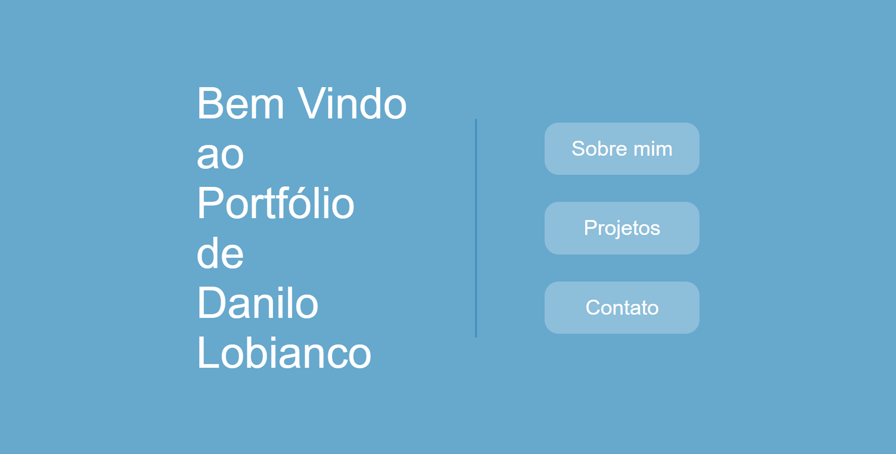
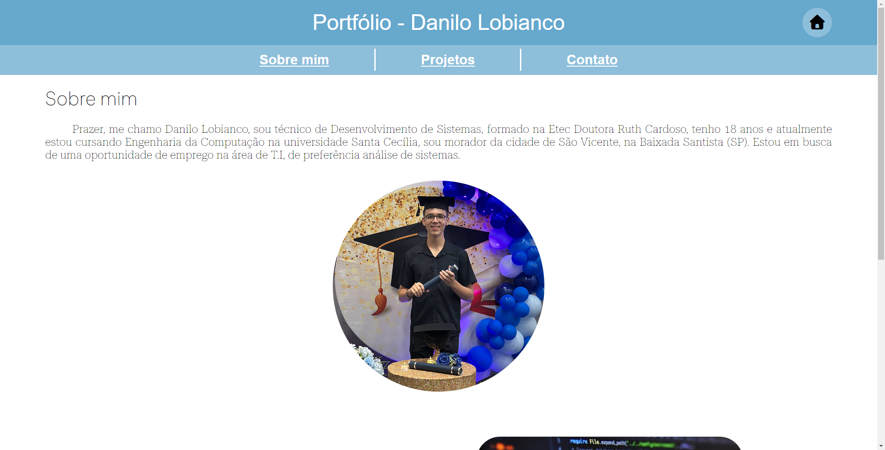
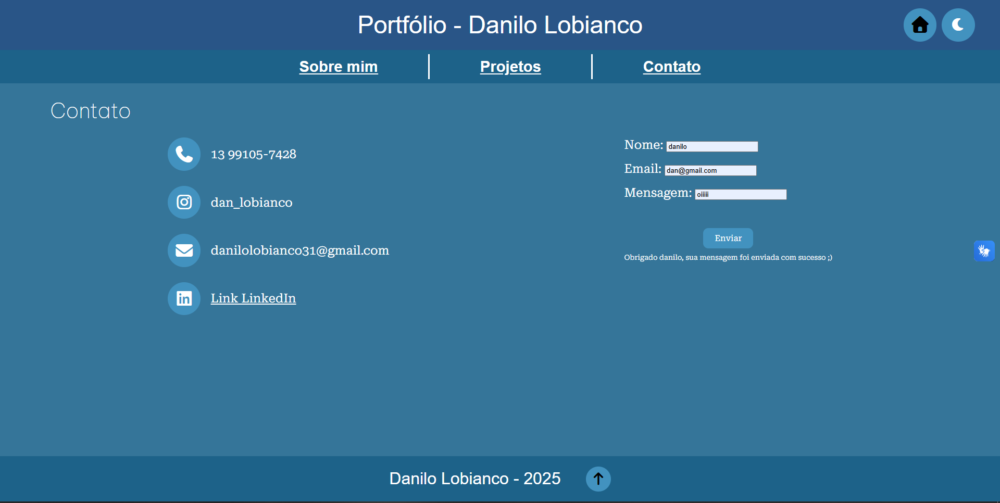
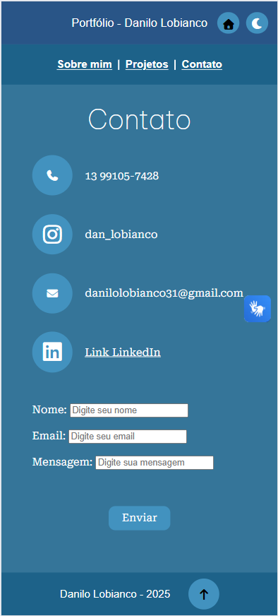

# 📁 Portfólio Pessoal - Front-End 

Este é meu projeto final desenvolvido durante o curso **Tecnologia Web - Engenharia da Computação (Front-End)**. Trata-se de um site de portfólio pessoal com informações sobre mim, meus projetos e formas de contato.

---

## 📌 Sobre o Projeto

Este site foi criado com foco em aplicar os conhecimentos de **HTML**, **CSS**, **JavaScript**, **Flexbox** e **responsividade**.

O projeto foi dividido em duas fases:
- **Parte 1 (Semana 5):** Estruturação HTML e protótipo no Figma  
- **Parte 2 (Semana 11):** Finalização com responsividade e interatividade

---

## 🧪 Funcionalidades

- Página **Sobre Mim** com imagem e descrição
- Seção de **Projetos** com links e descrições
- Formulário de **Contato** com validação básica
- **Tema claro/escuro** com JavaScript
- **Layout responsivo** (mobile e desktop)
- **Animações** e efeitos visuais com CSS

---

## 🧰 Tecnologias Utilizadas

- HTML5
- CSS3 + Flexbox
- JavaScript (básico)
- Google Fonts
- Font Awesome
---

## 🎨 Protótipo (Figma ou Similar)

Link para o protótipo criado no Figma:  
[🔗 Ver protótipo](https://www.figma.com/design/HBkX5UqGHyFeybBUeMiG1b/prototipo-proj?node-id=26-41&t=ysH1ZXSjCkjtaBqf-1)

---

## 🔗 Acesso ao Projeto

- **GitHub Pages:** [Clique aqui para acessar o site](https://seuusuario.github.io/nome-do-repositorio/)
- **Repositório GitHub:** [Acesse o código-fonte aqui](https://github.com/seuusuario/nome-do-repositorio)

---

## 📸 Capturas de Tela

> (Adicione aqui imagens do seu projeto rodando – Print da versão desktop e mobile)

---

## 📄 Licença

Este projeto é de uso educacional, criado como parte da disciplina **Tecnologia Web**.

---

## 🙋‍♀️ Desenvolvido por

**Danilo Dias Lobianco Soares | RA: 253862**  
Turma: [2º Semestre Engenharia da Computação]  
Email: [danilolobianco31@gmail.com]  
GitHub: [https://github.com/seuusuario](https://github.com/seuusuario)
